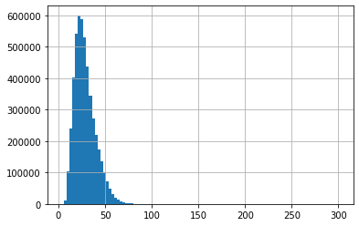
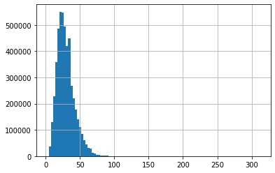

# Deep Encoder Shallow Decoder

Minimal Implementation of Paper [Deep Encoder Shallow Decoder](https://arxiv.org/abs/2006.10369) using Pytorch nn.Transformer and Huggingface Tokenizer.

## BLEU Score and Translation Examples

|         |                                                        Korean ➡️ English                                                        | English ➡️ Korean |
| ------- | :-----------------------------------------------------------------------------------------------------------------------------: | :---------------: |
| BLEU    |                                                              35.82                                                              |         -         |
| Example | [🔗 Translation Result](https://docs.google.com/spreadsheets/d/1IqEuRuEpphPEX3ni1m0EwqYuOU4E4t4-jC6uullpJhE/edit#gid=204599913) |         -         |

## Model

- Sequence to Sequence Transformer model using [nn.Transformer](https://pytorch.org/docs/stable/generated/torch.nn.Transformer.html)
- Packaged with Huggingface PretrainedModel Class

```python
from transformers import PreTrainedTokenizerFast
from model import DeepShallowModel, DeepShallowConfig

# source and target tokenizer
korean_tokenizer = PreTrainedTokenizerFast.from_pretrained("snoop2head/Deep-Shallow-Ko")
english_tokenizer = PreTrainedTokenizerFast.from_pretrained("snoop2head/Deep-Shallow-En")

# Korean(source) -> English(target) translation with pretrained model
config = DeepShallowConfig.from_pretrained("snoop2head/Deep-Shallow-Ko2En")
model = DeepShallowModel(config)

# English(source) -> Korean(target) translation with pretrained model
config = DeepShallowConfig.from_pretrained("snoop2head/Deep-Shallow-En2Ko") 
model = DeepShallowModel(config)
```

| Model Hyperparameter                  | Value |
| ------------------------------------- | ----- |
| Encoder embedding dimension           | 512   |
| Encoder feedforward network dimension | 2048  |
| Decoder embedding dimension           | 512   |
| Decoder feedforward network dimension | 2048  |
| # Encoder Attention Heads             | 8     |
| # Decoder Attention Heads             | 8     |
| # Encoder Layers                      | 12    |
| # Decoder Layers                      | 1     |

| Training Hyperparameter | Value            |
| ----------------------- | ---------------- |
| Train Batch Size        | 256              |
| # Train Steps           | 190K             |
| Optimizer               | AdamW            |
| Learning Rate           | 5e-4             |
| Weight decay rate       | 1e-2             |
| Learning Rate Scheduler | Cosine Annealing |
| # Warm-up Steps         | 4700             |
| Dropout rate            | 0.1              |
| AdamW betas             | (0.9, 0.98)      |
| Loss function           | CrossEntropy     |

## Dataset

Datasets were proviced by [AIHub](https://aihub.or.kr/aihub-data/natural-language/about), which were Korean - English pairs.

| Dataset Information                | Value        |
| ---------------------------------- | ------------ |
| Train set size (#pairs)            | 4.8 Million  |
| Valid set size (#pairs)            | 0.1 Million  |
| Test set size (#pairs)             | 0.1 Million  |
| Tokenizer                          | WordPiece    |
| Source Vocab Size                  | 10000        |
| Target Vocab Size                  | 10000        |
| Max token length                   | 64           |
| Positional encoding maximum length | 64           |
| Source Language                    | Korean (ko)  |
| Target Language                    | English (en) |

Parallel corpus shape of source langauge and target language pairs.
| Index | source_language | target_langauge |
| ----- | ------------------------------------------------------------ | ------------------------------------------------- |
| 1 | 귀여움이 주는 위로가 언제까지 계속될 수는 없다. | Comfort from being cute can't last forever. |
| 2 | 즉, 변환 처리부(114A)는 백색-포화 영역에 해당하는 영역에서의 불필요한 휘도 ... | In other words, the conversion processor 114A ... |

Maximum Token Length was selected as 62 which is 95% percentile of the target dataset.

| Source Language(Korean) Token Length Distribution      | Target Language(English) Token Length Distribution       |
| ------------------------------------------------------ | -------------------------------------------------------- |
|  |  |

## TO-DO

- [ ] Knowledge distllation is yet to be applied.
- [x] Package seq2seq transformer model to huggingface hub.
- [x] Make Machine Translation Model class similar to MarianMTModel in order to be trainable with huggingface trainer.
- [x] Get BLEU score from the test set.
- [ ] Compare BLEU score from Google Translate, Papago, [Pororo](https://kakaobrain.github.io/pororo/seq2seq/mt.html) on the test set(or test set which is out of domain).
- [ ] For tasks such as Named Entity Relation or Relation Extraction, enable entity marker to wrap around even after translation

## Citation

```
@article{Kasai2020DeepES,
  title={Deep Encoder, Shallow Decoder: Reevaluating the Speed-Quality Tradeoff in Machine Translation},
  author={Jungo Kasai and Nikolaos Pappas and Hao Peng and J. Cross and Noah A. Smith},
  journal={ArXiv},
  year={2020},
  volume={abs/2006.10369}
}

inproceedings{opennmt,
  author    = {Guillaume Klein and
               Yoon Kim and
               Yuntian Deng and
               Jean Senellart and
               Alexander M. Rush},
  title     = {OpenNMT: Open-Source Toolkit for Neural Machine Translation},
  booktitle = {Proc. ACL},
  year      = {2017},
  url       = {https://doi.org/10.18653/v1/P17-4012},
  doi       = {10.18653/v1/P17-4012}
}
```

- [LANGUAGE TRANSLATION WITH NN.TRANSFORMER AND TORCHTEXT](https://pytorch.org/tutorials/beginner/translation_transformer.html)
- [The Annotated Transformer](https://nlp.seas.harvard.edu/2018/04/03/attention.html)
